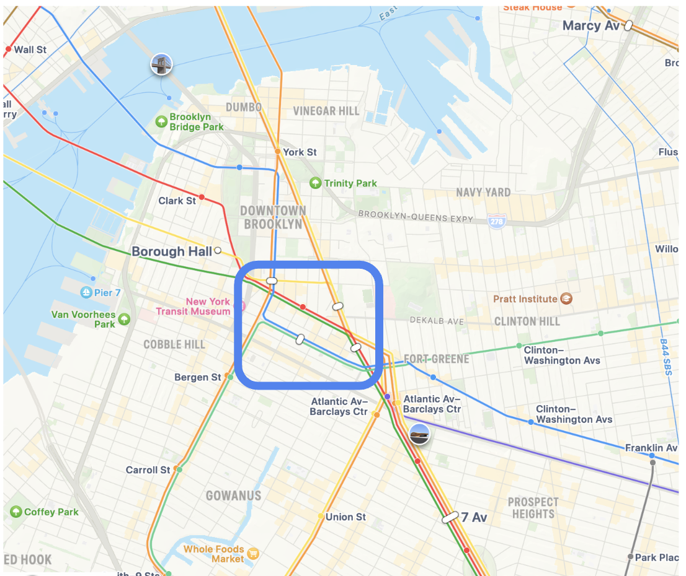
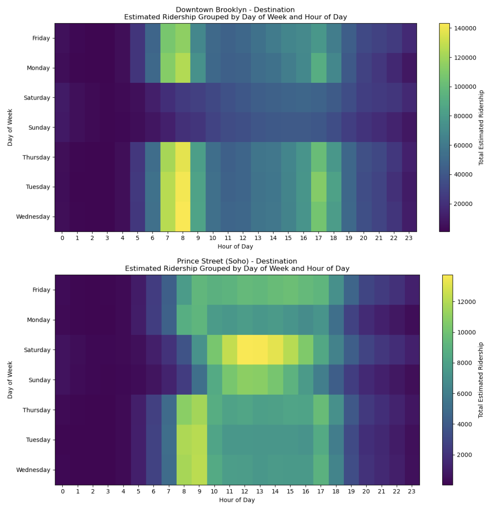
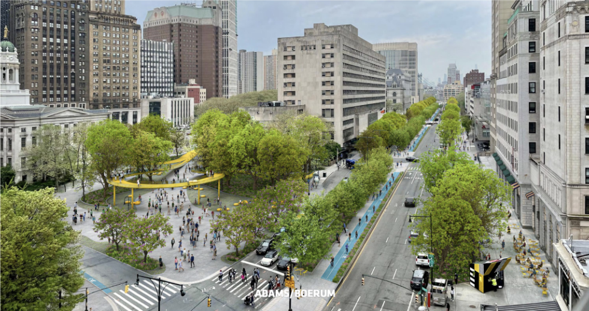

---
# Basic Project Information
title: "Downtown Brooklyn Partnership"
description: "Analysis of the Downtown Brooklyn Partnership, a major commercial and cultural district in Brooklyn."
publishDate: 2023-10-01
updatedDate: 2023-10-15
thumbnail: "../../assets/dtbk.png"

# BID-specific Information
bidName: "Fulton Mall Improvement Association"
borough: "Brooklyn"
yearEstablished: 2006

# Content Classification
featured: true
draft: false
revisionMode: true
tags: ["Commercial Hub", "Education", "Cultural District", "Urban Development"]

# Visualization Component References
# This string must match a key in ComponentRegistry.jsx
insightComponents: ["src/components/groups/dtbk/InsightIframe.jsx"]
transformationComponents: ["src/components/groups/dtbk/TransformationIframe.jsx"]
predictionComponents: ["/components/groups/dtbk/DBP - Predictions.jpg"]
consensusComponents: ["/components/groups/dtbk/placeholder.png"]

# Data Sources and Techniques
dataSource: "NYC Open Data, Downtown Brooklyn Partnership Annual Reports, Census Data, Real Estate Market Data, Transit Data, Academic Institution Statistics"
visualizationTechniques: ["Time Series Analysis", "Comparative Metrics", "Spatial Analysis", "Economic Impact Assessment", "Transit Flow Analysis"]
---

# Downtown Brooklyn Partnership: Analyzing a Dynamic Urban Core

The **Downtown Brooklyn Partnership (DBP)** stands as a key steward of New York City’s third-largest central business district. Since its establishment in 2006, the DBP has provided management and strategic vision across a significant 1.8 square mile area encompassing three distinct Business Improvement Districts: MetroTech, Fulton Mall, and Court-Livingston-Schermerhorn.

<figure style="max-width: 80%; margin: auto; display: block;">
  
  <figcaption style="text-align: center;">An introduction to Downtown Brooklyn and the Partnership.</figcaption>
</figure>

This district is far more than just a commercial center; it is a complex urban environment hosting major educational institutions like NYU Tandon, LIU, and City Tech, vital government offices, prominent cultural venues, and a rapidly expanding residential populace. Downtown Brooklyn is currently navigating a significant transformation, shifting from its historical role as a primarily car-oriented commercial and governmental hub towards a more diverse, mixed-use neighborhood characterized by increasing residential density, evolving retail landscapes, and ongoing public space enhancements.

This report investigates the multifaceted dynamics of Downtown Brooklyn through the analytical lenses of **Insight**, **Transformation**, **Prediction**, and **Consensus**. Our investigation focuses specifically on the Downtown Brooklyn Partnership district's challenges, opportunities, and the potential impacts of strategic urban interventions designed to enhance its economic vitality and improve its public realm, preparing DTBK for future neighborhood and societal changes.

---

## Insight Analysis: Understanding Downtown Brooklyn's Evolving Landscape

Downtown Brooklyn is defined by its rapid pace of change and the interplay of diverse forces shaping its urban fabric. Understanding this landscape requires examining shifts in its population, the functionality of its public spaces, the expression of its cultural identity, and the underlying governance structures.

One of the most significant recent shifts is the dramatic increase in **residential development**. The district, traditionally dominated by large office buildings and governmental facilities, now features numerous high-rise residential towers, often incorporating street-level retail. This signals not only a growing population but also a change in its composition, with an influx of higher-income residents drawn to the new housing stock and proximity to transit. Alongside this, a large student population contributes significantly to the area's daytime activity. While this mixed-use growth brings vibrancy, it also contributes to a sense of transience, as many individuals primarily commute into or through the district for work or study without deeply engaging with its local businesses or community life. This pattern of movement highlights the transient nature of many who pass through the district daily.

<figure style="max-width: 80%; margin: auto; display: block;">
  
  <figcaption style="text-align: center;">Downtown Brooklyn experiences significant transience from commuters, students, shoppers, and tourists.</figcaption>
</figure>

Examining transit ridership data provides a clearer picture of this transient population and their primary modes of entry and exit from the district.

<figure style="max-width: 80%; margin: auto; display: block;">
  
  <figcaption style="text-align: center;">Subway ridership data highlights the large volume of people entering and leaving the district daily.</figcaption>
</figure>

While foot traffic has seen some recovery post-pandemic, it still lags behind pre-recession levels, indicating a potential shift in commuter and shopping behavior that impacts local businesses and the district's overall vitality.

<figure style="max-width: 80%; margin: auto; display: block;">
  
  <figcaption style="text-align: center;">Foot traffic trends indicate the ongoing challenge of full recovery since the pandemic.</figcaption>
</figure>

Despite significant BID investment, the revenue generated within the district has not fully justified the costs, underscoring the need to convert this transience into sustained local economic engagement and demonstrate clearer returns on investment.

<figure style="max-width: 40%; margin: auto; display: block;">
  
  <figcaption style="text-align: center;">High BID investment versus revenue generation is a key financial challenge.</figcaption>
</figure>

The **physical infrastructure** of Downtown Brooklyn presents both assets and challenges. While new public spaces and streetscape improvements have emerged, major thoroughfares such as Flatbush Avenue, Tillary Street, and Adams Street continue to function as high-traffic arterials. These "stroads"—characterized by fast-moving vehicular traffic alongside commercial properties—create significant barriers to pedestrian movement, impacting safety and limiting seamless connectivity within the district. Navigating intersections designed primarily for cars can be hazardous, fragmenting the pedestrian experience despite efforts to improve walkability. Visualizations based on NYC Open Data and site observations highlight these conflict points, particularly where major roads intersect pedestrian-heavy areas near transit hubs and retail corridors. These highways act as formidable barriers, limiting easy access into the core BID areas.

<figure style="max-width: 80%; margin: auto; display: block;">
  
  <figcaption style="text-align: center;">Highways and major roads create significant barriers to pedestrian access into the BID core.</figcaption>
</figure>

A detailed map of these highway barriers underscores the challenge of crossing into the district.

<figure style="max-width: 80%; margin: auto; display: block;">
  
  <figcaption style="text-align: center;">Mapping major arterial roads illustrates physical barriers to walkability.</figcaption>
</figure>

Key subway stops and public housing developments are often concentrated along these barrier roads, making safe and easy access to the BID core crucial for connectivity, access, and equity for a significant portion of the population.

<figure style="max-width: 80%; margin: auto; display: block;">
  
  <figcaption style="text-align: center;">Subways and public housing are often located near highway barriers, impacting access.</figcaption>
</figure>

Downtown Brooklyn's **public spaces and cultural assets** contribute significantly to its character, though their impact varies across the district. Existing plazas, such as MetroTech Commons, offer valuable seating and programming opportunities but often see peak use tied to specific events or times of day. There are observable gaps in elements that encourage pedestrian comfort and linger time, such as adequate greenery and shade, especially on streets that have not yet undergone significant revitalization. Public art installations, including murals and temporary exhibits, enhance the aesthetic appeal but tend to be concentrated in specific pockets, leaving other areas feeling primarily functional or commercial. While seasonal events successfully draw crowds, cultivating year-round cultural engagement is key to fully activating the public realm and fostering a stronger sense of place. The DBP also provides active sanitation and safety crews, visible throughout the district in bright uniforms, contributing to the perception and reality of a clean and safe environment for residents and visitors alike.

<figure style="max-width: 80%; margin: auto; display: block;">
  
  <figcaption style="text-align: center;">Active and visible sanitation and safety crews contribute to the BID's cleanliness and safety.</figcaption>
</figure>

Finally, the **governance structure** of the Business Improvement Districts under the DBP plays a crucial role in shaping development, yet it is not without its complexities. As articulated by Robert Perris, former Manager of Brooklyn Community District 2, while BIDs can be powerful tools for supplementing municipal services and improving public spaces, their funding model—primarily through property owner assessments—can inherently prioritize the interests of large landowners. This dynamic can sometimes lead to tensions, particularly regarding the rapid pace of high-rise development often described as the "Manhattanization" of Downtown Brooklyn. This transformation, characterized by tall buildings and escalating rents, raises concerns among community members about affordability and the potential displacement of long-standing small businesses and residents, highlighting the need for inclusive planning processes that consider a broader range of voices beyond major property stakeholders. Speaking with stakeholders like a former community district manager provided valuable qualitative insights into these tensions and the perpetual state of change in DTBK, noting the mixed public perception of increased density and cost of living.

<figure style="max-width: 80%; margin: auto; display: block;">
  
  <figcaption style="text-align: center;">Insights from a conversation with former Community District 2 Manager, Robert Perris.</figcaption>
</figure>

---

## Transformation Analysis: Strategies for a More Connected and Engaging Downtown Brooklyn

Based on our insights into Downtown Brooklyn's current state and challenges, we propose a two-pronged approach to foster transformative change: enhancing digital engagement to connect transient populations with local offerings and implementing physical infrastructure improvements to create a more walkable and permeable urban environment. Aligning with the DBP's existing plans, which foresee increased pedestrian areas by 2030 as outlined in their Public Realm Action Plan, is a key consideration for any proposed transformation to ensure synergy with ongoing efforts.

<figure style="max-width: 80%; margin: auto; display: block;">
  
  <figcaption style="text-align: center;">Downtown Brooklyn Partnership's Public Realm Action Plan includes significant planned walking areas by 2030.</figcaption>
</figure>

Our first strategy centers on **digital engagement** through a proposed mobile application, tentatively named **"DTBK Connect."** The core objective is to actively convert the significant transient foot traffic—the thousands of commuters, students, and visitors who pass through Downtown Brooklyn daily—into engaged participants in the local economy and cultural life. This initiative aims to bridge the gap between simply moving through the district and actively participating in it.

The app would feature **QR Code Check-Ins** at participating businesses, restaurants, and cultural venues, allowing users to earn points for their patronage, redeemable for discounts or special offers. This directly incentivizes visiting and spending locally while providing the BID with valuable data on consumer flow. To encourage deeper exploration, **Walk and Explore Incentives** would award points for completing designated pedestrian routes or visiting specific cultural sites, promoting discovery beyond routine commuter paths. Integrating **Cultural and Event Participation** would provide extra rewards for attending local performances, art shows, or community events, boosting awareness and attendance. Finally, **Gamification** elements like leaderboards, achievement badges, and loyalty tiers would encourage repeat visits and build a sense of connection to the district. The implementation of this app could follow a phased approach, beginning with a pilot involving a limited number of businesses, expanding to include cultural institutions, and eventually aiming for full integration with transit touchpoints to create a seamless district-wide system. The projected outcomes include increased local spending, richer data on user behavior for targeted BID initiatives, and potentially a stronger sense of community among app users.

The second strategy involves **physical infrastructure improvements** focused on enhancing pedestrian safety, comfort, and connectivity. Addressing the barriers posed by major arterial roads is paramount. This includes implementing **Improved Crosswalks and Wayfinding** at critical intersections, particularly along Adams Street and where it meets Fulton Street. This would involve increasing the visibility of crossings, optimizing signal timing for pedestrians, and installing clear, intuitive signage to guide visitors from transit hubs towards the BID's core commercial areas. Building on the idea of reclaiming street space, we propose concepts like **Promenades or “Shared Streets”** in underutilized areas, such as narrow parking lots or wide medians. These spaces could be transformed into pedestrian-prioritized corridors with seating, greenery, and shade, encouraging people to linger and interact rather than simply passing through. One particular point of focus is the complex intersection at Brooklyn Bridge Boulevard and Fulton Street. This 5-way intersection is a key point connecting Columbus Park and the walkable core of DTBK. The presence of a parking lot in the middle can discourage entry and block views, making it uninviting.

<figure style="max-width: 80%; margin: auto; display: block;">
  
  <figcaption style="text-align: center;">Focusing on the complex intersection at Brooklyn Bridge Boulevard and Fulton Street.</figcaption>
</figure>

An example of this concept could involve transforming the parking lot at the intersection of focus into a decorated promenade connecting Columbus Park to Downtown Brooklyn, a concept also considered in the DBP's plans.

<figure style="max-width: 80%; margin: auto; display: block;">
  
  <figcaption style="text-align: center;">A conceptual rendering of a promenade replacing the parking lot at the intersection of focus (Image Credit: DBP Partnership).</figcaption>
</figure>

Another transformation idea for this intersection is an **Extended or Midblock Crosswalk** from the northern side of Fulton-Columbus to Willoughby Plaza, providing a more direct and safer connection for pedestrians navigating this busy junction.

<figure style="max-width: 80%; margin: auto; display: block;">
  
  <figcaption style="text-align: center;">Proposal for an extended or midblock crosswalk to improve connectivity.</figcaption>
</figure>

For high-risk zones with significant traffic volume, exploring the possibility of an **Overpass or Underpass**—for example, connecting Borough Hall and Columbus Park more directly to the Fulton Mall area across Tillary Street or Brooklyn Bridge Boulevard—could dramatically reduce pedestrian-vehicle conflicts and improve access. Any such major intervention would need careful design to ensure it does not detract from ground-level retail activity, maintaining vibrancy through integrated access points and visible signage. Implementation could be phased, starting with temporary tactical urbanism interventions (paint, bollards, pilot closures), moving to semi-permanent structures (planters, improved landscaping), and finally considering larger-scale projects like overpasses if data from earlier phases supports their necessity and potential impact. These physical transformations, supported by data visualizations of pedestrian paths and accident hotspots, aim to make Downtown Brooklyn more permeable, safer, and more inviting for everyone on foot. We also experimented with a street view tool that uses segmentation to visualize potential changes in the urban environment.

<figure style="display: flex; gap: 1rem; justify-content: center;">
    <figure style="width: 48%;">
        
        <figcaption style="text-align: center;">Using a street view tool to visualize potential urban design changes.</figcaption>
    </figure>
    <figure style="width: 48%;">
        
        <figcaption style="text-align: center;">Segmented street view image demonstrating areas for potential interventions.</figcaption>
    </figure>
</figure>

For example, visualizing changes at the Tillary - Brooklyn Bridge Blvd intersection, highlighting areas like overpasses or tunnels.

<figure style="max-width: 80%; margin: auto; display: block;">
  
  <figcaption style="text-align: center;">Segmented street view of the Tillary - Brooklyn Bridge Blvd intersection.</figcaption>
</figure>

Simple pilot solutions could include adding pedestrian-friendly elements like seating, fountains, and improved signage in key areas to test impact before larger investments.

<figure style="display: flex; gap: 1rem; justify-content: center;">
    <figure style="width: 31%;">
        
        <figcaption style="text-align: center;">Pilot concept: adding seating.</figcaption>
    </figure>
    <figure style="width: 31%;">
        
        <figcaption style="text-align: center;">Pilot concept: fountain feature.</figcaption>
    </figure>
     <figure style="width: 31%;">
        
        <figcaption style="text-align: center;">Pilot concept: improved signage.</figcaption>
    </figure>
</figure>

Below, we show a further result from our transformation process, in which by analyzing the current permits in Brooklyn, we realize that the edges of the Downtown Brooklyn Partnership, especially near the borders of the BIDs, have heavy construction. This further serves as a deterrent to entering the BID.

---

## Prediction Analysis: Forecasting Impacts of Intervention

To move beyond theoretical proposals and understand the potential real-world effects of our proposed digital and physical transformations, we employ predictive modeling tools. Using approaches like **GAMA agent-based modeling** and spatial analysis with **OSMnx and NetworkX** in Python, we can simulate how changes to the urban environment might influence pedestrian behavior, economic outcomes, and even environmental factors.

Agent-based modeling allows us to simulate individual pedestrian movements and their responses to changes like improved crossings or new walkable paths. We used GAMA to model agents representing people moving within the Downtown Brooklyn area, simulating how many agents would successfully enter the core BID district.

<figure style="max-width: 40%; margin: auto; display: block;">
  
  <figcaption style="text-align: center;">A GAMA agent-based model simulating pedestrian movements via road weights in Downtown Brooklyn.</figcaption>
</figure>

Our model grounds agent behavior in reality, using data like open street maps to categorize buildings and weight roads for walkability, reflecting commuting flow patterns observed from real data.

<figure style="display: flex; gap: 1rem; justify-content: center;">
    <figure style="width: 48%;">
        
        <figcaption style="text-align: center;">GAMA model visualizing origin points of agents.</figcaption>
    </figure>
     <figure style="width: 48%;">
        
        <figcaption style="text-align: center;">Simulated commuting flow paths in the GAMA model.</figcaption>
    </figure>
</figure>

A key finding from these simulations relates to what we term "highway reluctance"—the perceived difficulty or danger of crossing major arterial roads. Our models incorporate specific logic to account for this barrier, assigning an additional cost to routes that require crossing a highway.

<figure style="max-width: 80%; margin: auto; display: block;">
  
  <figcaption style="text-align: center;">Logic incorporated into the GAMA model to simulate the impact of highway barriers on pedestrian movement.</figcaption>
</figure>

Simulations predict that reducing this barrier through interventions like enhanced crosswalks or an overpass could lead to a significant increase in the number of pedestrians choosing to enter the BID's core areas. Simulations suggest this effect could be as substantial as a **31% increase in maximum visitors** when the perceived pedestrian risk along these major arteries is significantly lowered. This is visualized by comparing a control scenario with high highway reluctance to a treatment scenario with reduced reluctance, showing a higher visitor rate in the treatment group.

<figure style="display: flex; gap: 1rem; justify-content: center;">
    <figure style="width: 48%;">
        
        <figcaption style="text-align: center;">GAMA simulation demonstrating the effect of reduced 'highway reluctance' on pedestrian entry into the BID core.</figcaption>
    </figure>
     <figure style="width: 48%;">
        
        <figcaption style="text-align: center;">Graph comparing BID visitor rates in control (baseline reluctance) vs. treatment (reduced reluctance) GAMA simulations.</figcaption>
    </figure>
</figure>

This predicted increase in foot traffic has direct implications for the local economy. By analyzing correlations from other urban centers that have successfully implemented similar walkability improvements, we estimate that a **10–15% rise in pedestrian volumes** could translate into an approximately **9% increase in local retail sales**. Furthermore, sustained higher foot traffic could contribute to a modest **3% reduction in storefront vacancies**, assuming supportive policies that encourage small business stability are also in place. These potential retail benefits are supported by research on sales growth through staffing optimization and improved customer experience.

Beyond pedestrian and economic impacts, our analysis considers the potential environmental effects of improving transit infrastructure. Collaborating with agencies like the MTA and DOT to implement measures such as dedicated bus lanes or signal priority to boost bus speeds within the district could have a cascading positive effect on ridership and emissions. Data suggests that speeding up buses can lead to increased ridership and reduced CO2 emissions, a relationship supported by various transit studies.

By modeling different intervention scenarios, we can provide stakeholders with quantitative estimates of potential outcomes. The table below summarizes the predicted impacts of various physical transformation approaches discussed earlier, offering a comparative view of their potential benefits across several key metrics:

| Scenario                | Walking Distance | Accident Reduction | New Public Realm | Potential Retail Growth |
|-------------------------|------------------|--------------------|------------------|-------------------------|
| **Base (Current State)**| High friction    |  —                | None             |  —                     |
| **Promenade** | Moderately lower | Significant        | Yes (plaza)      | 8–10% increase         |
| **Overpass** | Lowest distance  | Highest            | Elevated route   | 10–12% increase        |
| **Midblock Crossing** | Moderate         | Moderate           | Minimal new space| 5–7% increase          |

These predictions, derived from data-driven models, offer valuable insights into the potential return on investment for different urban interventions and can help guide strategic planning and resource allocation within the Downtown Brooklyn Partnership. Visualizing the potential for enhanced walkways further illustrates these possibilities.

---

## Consensus Analysis: Building a Shared Vision for Downtown Brooklyn

Translating data-driven insights and proposed transformations into actionable urban change requires engaging a diverse array of stakeholders and fostering a process of consensus-building. Traditional public engagement methods, such as town hall meetings, often fail to capture the perspectives of the very people who interact with Downtown Brooklyn daily—the students, commuters, shoppers, and visitors who contribute significantly to its dynamism but may not have the time or means to participate in formal processes. As Robert Perris observed, while the district is shaped by these daily users, their voices are often missing from the decision-making table, which tends to be structured around institutional actors and property owners.

<figure style="max-width: 80%; margin: auto; display: block;">
  
  <figcaption style="text-align: center;">Thousands move through DTBK daily, yet they aren't systematically engaged in its design.</figcaption>
</figure>

The current planning process often focuses on institutional stakeholders, leaving out the daily users whose experiences are critical to understanding the district's public realm.

<figure style="max-width: 80%; margin: auto; display: block;">
  
  <figcaption style="text-align: center;">Engagement is often structured around institutions, not the diverse people who use the space daily.</figcaption>
</figure>

To address this "engagement gap," we propose **StreetStudio**, a system designed to bring the decision-making process directly to the street, meeting people where they are and making participation easy and accessible.

<figure style="max-width: 80%; margin: auto; display: block;">
  
  <figcaption style="text-align: center;">Introducing StreetStudio: A Walkable Co-Design System.</figcaption>
</figure>

StreetStudio envisions multiple low-barrier methods for gathering input. **Pop-Up Design Walls** could be installed in public plazas and high-traffic areas, featuring visual proposals for streetscape improvements or public space uses. Passersby could provide feedback through simple methods like placing stickers on preferred designs or writing comments directly on the wall.

Complementing these methods would be **Mobile & Text Polling**, allowing individuals to provide input via their smartphones. QR codes placed at intersections could direct users to short, location-specific polls about safety, cleanliness, or preferred street amenities. Furthermore, a simple **Civic Text Hotline** could allow anyone to report issues (e.g., "broken curb on Jay St," "trash overflow near LIU campus") via text message or WhatsApp, providing a direct, low-friction feedback loop from everyday users to the BID and city agencies.

The data collected through these methods would feed into **Transparent Dashboards**, accessible to key stakeholders.

<figure style="max-width: 80%; margin: auto; display: block;">
  
  <figcaption style="text-align: center;">The StreetStudio Dashboard makes participation visible and links feedback to data.</figcaption>
</figure>

These dashboards would visualize design preferences by location, allow filtering responses by stakeholder type (e.g., separating student feedback from resident reports), and critically, allow for overlaying community input with data from our earlier simulations (e.g., identifying areas where community requests for lighting align with predicted high-conflict zones from the GAMA model). This allows for targeted action where community concerns and data-driven insights converge.

Identifying and engaging the "Agents of Change" is crucial for implementation. These include the **DBP and city agencies** (such as DOT and SBS), who would utilize the aggregated dashboard analytics for planning and resource allocation. **Business Owners** would receive targeted alerts and summaries related to their immediate surroundings (sidewalk conditions, foot traffic patterns). **Residents, Students, and Visitors**—the everyday users—would engage through the low-barrier StreetStudio tools. **Academic Partners** and civic tech groups could leverage the data for further analysis and research, while **Advocacy Groups** could use the transparent dashboard to monitor changes and ensure the representation of diverse community needs, including accessibility and language considerations. The goal is to create a continuous feedback loop where insights from the street directly inform planning and decision-making, making the process more responsive, representative, and ultimately, building greater trust and shared ownership in the future of Downtown Brooklyn.

<figure style="max-width: 80%; margin: auto; display: block;">
  
  <figcaption style="text-align: center;">Identifying the key stakeholders who can influence or implement proposed interventions.</figcaption>
</figure>

---

## Conclusion and Next Steps

Downtown Brooklyn is a district on the cusp of its next major evolution. Its inherent strengths as a commercial, educational, and cultural hub, coupled with the energy of a growing residential population, provide a powerful foundation for future growth. However, realizing this potential requires directly addressing existing challenges related to fragmented walkability, fostering deeper engagement from its transient populations, and navigating the complexities of multi-stakeholder governance while preserving affordability and inclusivity.

Our analysis and proposed interventions—ranging from digital tools like the "DTBK Connect" app to physical enhancements such as improved crossings and pedestrian promenades—offer concrete pathways towards a more connected, vibrant, and equitable Downtown Brooklyn. Leveraging data-driven prediction tools like GAMA and spatial analysis allows us to forecast the potential impacts of these changes on foot traffic, economic activity, and environmental outcomes, providing an evidence base for decision-making. Crucially, the success of any intervention hinges on establishing robust, inclusive processes for **Consensus**. The StreetStudio framework, with its emphasis on low-barrier, location-specific engagement and transparent data sharing, is designed to empower the diverse voices that make up Downtown Brooklyn, ensuring that its future development reflects the needs and aspirations of everyone who uses the district daily.

Moving forward, the critical next steps involve piloting the proposed interventions on a small scale, rigorously monitoring their effectiveness using tools such as pedestrian counters, business revenue trackers, and accident data analysis. This data will be essential for evaluating outcomes, refining successful strategies, and building the case for scaling interventions across the district. By combining strategic planning, innovative technology, and a deep commitment to inclusive community engagement, the Downtown Brooklyn Partnership has the opportunity to solidify the district's position as a thriving, walkable, and truly representative urban core for years to come.

---

## References and Data Sources

* Downtown Brooklyn Partnership. [https://www.downtownbrooklyn.com/](https://www.downtownbrooklyn.com/)
* Downtown Brooklyn Partnership Annual Reports. [https://www.downtownbrooklyn.com/about/annual-reports](https://www.downtownbrooklyn.com/about/annual-reports)
* NYC Small Business Services – BID Directory. [https://www1.nyc.gov/site/sbs/neighborhoods/business-improvement-districts.page](https://www1.nyc.gov/site/sbs/neighborhoods/business-improvement-districts.page)
* NYC Open Data Platform. Datasets utilized include BID boundaries, pedestrian counts, property data (MAPPluto), and Department of Buildings permit data. [https://opendata.cityofnewyork.us/](https://opendata.cityofnewyork.us/)
* Ellen, I. G., Schwartz, A. E., & Voicu, I. (2007). *The Impact of Business Improvement Districts on Property Values: Evidence from New York City*. Brookings-Wharton Papers on Urban Affairs, 1-39.
* Ratti, C., & Offenhuber, D. (2014). *Decoding the City: Urbanism in the Age of Information*. Birkhäuser.
* Noyman, A., Doorley, R., Xiong, Z., Alonso, L., Grignard, A., & Larson, K. (2019). Reversed Urbanism: Inferring urban performance through behavioral patterns in temporal telecom data. *Environment and Planning B: Urban Analytics and City Science*, 46(8), 1480-1498.
* Glaeser, E. L. (2011). *Triumph of the City: How Our Greatest Invention Makes Us Richer, Smarter, Greener, Healthier, and Happier*. Penguin Press.
* Federal Transit Administration, NYC Department of Transportation, and MTA Joint Reports and data briefs related to bus speed improvements, ridership, and emissions (referenced forecasts are based on typical correlation patterns observed in reports published between 2024–2025).
* Downtown Brooklyn Partnership Board Memo (Accessed via shared project materials).

---

*Contributors:*
*Thomas Wiener, Rajshri Jain, Ryan Lewis, Jackie Kim*